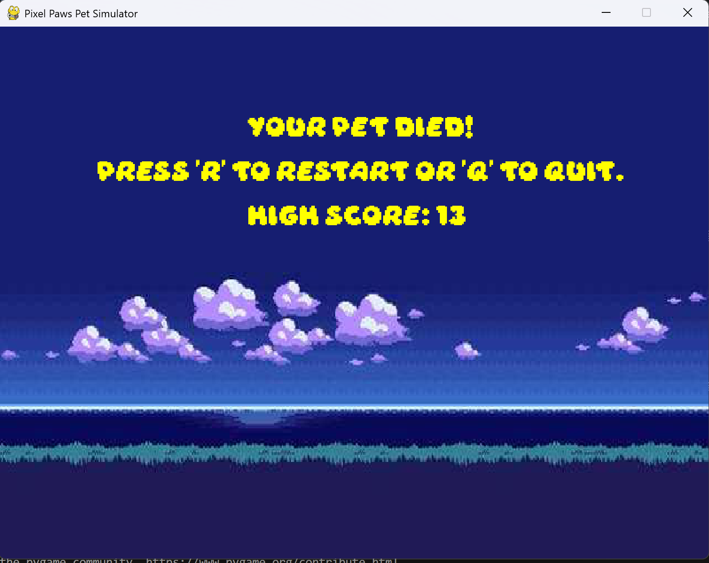

:warning: Everything between << >> needs to be replaced (remove << >> after replacing)

# Pixel Paws Pet Simulator
## CS110 Final Project  Fall, 2024

## Team Members

Marisa Keefe

***

## Project Description

My game is a pet simulator, inspired by Tomagatchi. In the start menu, the user can name their pet and select a cat or dog. Then, the user can click buttons to maintain the health, happiness, and hunger of the pet. If the user does not keep these ever-depleting status bars going, the pet dies and the game over screen comes up. 

***    

## GUI Design

### Initial Design

### Final Design

## Program Design

### Features

1. Start menu that lets user name pet, and select whether they want a cat or dog pet
2. Main game screen which has pet on it, pet's name on top of screen, and score of the user
3. Three buttons for user to click on game screen (play, feed, and pet) to up status bars and cause item to go on screen
4. Updating health, hunger, and happiness bar that continuously deplete until user hits buttons
5. Game over screen allowing user to restart or quit and see their high score

### Classes

- StartMenu:
    - Creates start menu screen with bar to type pet name in, cat or dog selection button, and start button
- Pet:
    - Creates pet objects for cat and dog selection importing a picture as the pet on screen
- StatusBar:
    - Creates status bars for health, happiness, and hunger that deplete with time and determine the life of the pet
- Game:
    - Creates game screen where the pet, buttons, and status bars are and the user can interact with the buttons
- HighScore:
    - Keeps track of user's high score, displays it on game over screen, and sends it to a JSON file
- Controller:
    - Puts the objects together, creating the game itself and a game over screen

## ATP

| Step                 |Procedure             |Expected Results                   |
|----------------------|:--------------------:|----------------------------------:|
|  1                   | Launch the Pixel Paws Pet Simulator Program  | GUI window opens with title "Pixel Paws Pet Simulator" and the Start Menu is displayed  |
|  2                   | Click "Cat" button | The selected pet is "Cat" and the pet image becomes a cat |
|  3                   | Click "Dog" button | The selected pet is "Dog" and the pet image becomes a dog |
|  4                   | Enter a name for the pet then press Enter | The name is put on game screen, and the main game screen displays |
|  5                   | Click "Start" button | The pet and main game screen appears |
|  6                   | Click "Play" button | The health status bar increases, and a ball image appears on screen temporarily |
|  7                   | Click "Feed" button | The hunger status bar increases, and a food bowl image appears on screen temporarily |
|  8                   | Click "Pet" button | The happiness status bar increases, and a heart image appears on screen temporarily |
|  9                   | Click "R" on Game Over screen | The start menu comes up and game restarts |
|  10                  | Click "Q" on Game Over screen | The game window closes |